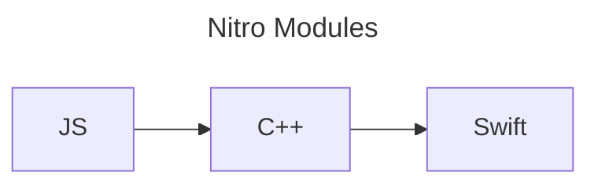
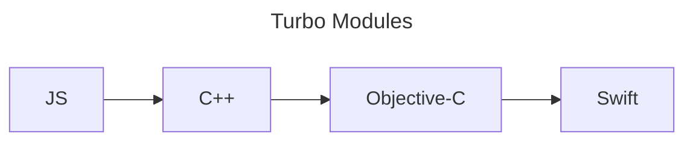

---
---

# Comparison with other frameworks

Nitro is not the only one of its kind. There's multiple ways to build native modules for React Native:

- Nitro Modules
- [Turbo Modules](#turbo-modules)
- [Legacy Native Modules](#legacy-native-modules)
- [Expo Modules](#expo-modules)

## Benchmarks

[This benchmark](https://github.com/mrousavy/NitroBenchmarks) compares the total execution time when calling a single native method 100.000 times:

<table>
  <tr>
    <th></th>
    <th>ExpoModules</th>
    <th>TurboModules</th>
    <th>NitroModules</th>
  </tr>
  <tr>
    <td>100.000x <code>addNumbers(...)</code></td>
    <td>434.85ms</td>
    <td>115.86ms</td>
    <td><b>7.27ms</b></td>
  </tr>
  <tr>
    <td>100.000x <code>addStrings(...)</code></td>
    <td>429.53ms</td>
    <td>179.02ms</td>
    <td><b>29.94ms</b></td>
  </tr>
</table>

Note: These benchmarks only compare native method throughput in extreme cases, and do not necessarily reflect real world use-cases. In a real-world app, results may vary. See [NitroBenchmarks](https://github.com/mrousavy/NitroBenchmarks) for full context.

It's not all about performance though - there are some key differences between Nitro-, Turbo- and Expo-Modules:

## Turbo Modules

[Turbo Modules](https://github.com/reactwg/react-native-new-architecture/blob/main/docs/turbo-modules.md) are React Native's default framework for building native modules.
They use a code-generator called "[codegen](https://github.com/reactwg/react-native-new-architecture/blob/main/docs/codegen.md)" to convert Flow (or TypeScript) specs to native interfaces, similar to Nitro's nitrogen.

<div className="side-by-side-container">
<div className="side-by-side-block">

```swift title="Nitro Module (Swift)"
class HybridMath : HybridMathSpec {
  func add(a: Double, b: Double) -> Double {
    return a + b
  }
}
```

</div>
<div className="side-by-side-block">

```objc title="Turbo Module (Objective-C)"
@implementation RTNMath
RCT_EXPORT_MODULE()

- (NSNumber*)add:(NSNumber*)a b:(NSNumber*)b {
  double added = a.doubleValue + b.doubleValue;
  return [NSNumber numberWithDouble:added];
}
@end
```

</div>
</div>

Turbo Modules can be built with Objective-C for iOS and Java for Android, or C++ for cross-platform.

### Shipped with react-native core

Unlike Nitro, Turbo Modules are actually part of react-native core. This means, users don't have to install a single dependency to build- or use a Turbo Module.

### Implementation details

#### No Swift

There is no direct Swift support for Turbo Modules. You could bridge from Objective-C to Swift, but that would still always go through Objective-C, which is comparatively slower than bridging directly from C++ to Swift, like Nitro does.

<div className="side-by-side-container">
<div className="side-by-side-block">



</div>
<div className="side-by-side-block">



</div>
</div>

#### No properties

A Turbo Module does not provide a syntax for properties. Instead, conventional getter/setter methods have to be used.

<div className="side-by-side-container">
<div className="side-by-side-block">

```swift title="Nitro Module (Swift)"
class HybridMath : HybridMathSpec {
  var someValue: Double
}
```

</div>
<div className="side-by-side-block">

```objc title="Turbo Module (Objective-C)"
@implementation RTNMath {
  NSNumber* _someValue;
}
RCT_EXPORT_MODULE()

- (NSNumber*)getSomeValue {
  return _someValue;
}
- (void)setSomeValue:(NSNumber*)someValue {
  _someValue = someValue;
}
@end
```

</div>
</div>

#### Not object-oriented

While a Turbo Module can represent many types from JavaScript, there is no equivalent to Nitro's **Hybrid Object** in Turbo Modules. Instead, every Turbo Module is a singleton, and every native method is similar to a static method.

Native objects, like Image instances, can not be represented in Turbo Modules. Common workarounds include writing the image to a file, converting images to base64 strings, or using Blobs - which all introduce runtime overhead and performance hits _just to pass an image instance to JS_.

<div className="side-by-side-container">
<div className="side-by-side-block">

```swift title="HybridImageEditor.swift"
class HybridImageEditor: HybridImageEditorSpec {
  func crop(image: HybridImage,
            size: Size) -> HybridImage {
    let original = image.cgImage
    let cropped = original.cropping(to: size)
    return HybridImage(cgImage: cropped)
  }
}
```

</div>
<div className="side-by-side-block">

```objc title="ImageEditor.mm"
@implementation ImageEditor
- (NSString*)crop:(NSString*)imageUri
             size:(CGRect)size {
  UIImage* image = [UIImage imageWithContentsOfFile:imageUri];
  CGImageRef cropped = CGImageCreateWithImageInRect([image CGImage], size);
  UIImage* croppedImage = [UIImage imageWithCGImage:cropped];
  CGImageRelease(cropped);

  NSString* fileName = [NSString stringWithFormat:@"%@.png", [[NSUUID UUID] UUIDString]];
  NSString* filePath = [NSTemporaryDirectory() stringByAppendingPathComponent:fileName];
  NSData* pngData = UIImagePNGRepresentation(croppedImage);
  [pngData writeToFile:tempPath atomically:YES];
  return tempPath;
}
@end
```

</div>
</div>

Using native objects (like the `HybridImage`) directly is much more efficient and performant, as well as more convenient to use than to write everything to a file.

#### No tuples

There are no tuples in Turbo Modules.

```ts
type SomeTuple = [number, number]
```

#### No callbacks with return values

Turbo Modules do not allow JS callbacks to return a value.

```ts
type SomeCallback = () => number
```

#### Events

Since functions are not first-class citizens in Turbo Modules, you cannot hold onto a JavaScript callback in native code and call it more often, like you could in Nitro.
Instead, Turbo Modules has "Events". Events are essentially just native functions that notify JS and potentially also pass data to JS more often.

<div className="side-by-side-container">
<div className="side-by-side-block">

```swift title="HybridMath.swift (Nitro)"
class Math: MathSpec {
  var listeners: [(String) -> Void] = []
  func addListener(listener: (String) -> Void) {
    listeners.add(listener)
  }

  func onSomethingChanged() {
    for listener in listeners {
      listener("something changed!")
    }
  }
}
```

</div>
<div className="side-by-side-block">

```objc title="RTNMath.mm (Turbo)"
@implementation RTNMath
RCT_EXPORT_MODULE();

- (NSArray<NSString *> *)supportedEvents {
  return @[@"onSomethingChanged"];
}

- (void)onSomethingChanged {
  NSString* message = @"something changed!";
  [self sendEventWithName:@"onSomethingChanged"
                     body:@{@"msg": message}];
}
@end
```

</div>
</div>

Events are untyped and have to be natively defined via `supportedEvents`. In Nitro, this would be fully typesafe as functions are first class citizens. (see `addListener(..)`)

#### HostObject vs NativeState

As of today, Turbo Modules are implemented using `jsi::HostObject`, whereas Nitro Modules are built with `jsi::NativeState`.
NativeState has been proven to be much more efficient and performant, as property- and method-access is much faster - it can be properly cached by the JS Runtime and does not involve any virtual/Proxy-like accessors.

Additionally, Nitro Modules properly set up memory pressure per object, so the JS garbage collector actually knows a native module's memory size and can properly delete them when no longer needed. This is not the case with Turbo Modules.

### Codegen

Codegen is similar to Nitrogen as it also generates native interfaces from TypeScript specifications. This ensures type-safety on the JavaScript side, as specs have to be implemented on the native side in order for the app to build successfully. This prevents any wrong type errors and ensures undefined/null-safety.

<div className="side-by-side-container">
<div className="side-by-side-block">

```ts title="Nitrogen"
interface Math extends HybridObject<{ … }> {
  add(a: number, b: number): Promise<number>
}

export const Math =
 NitroModules.createHybridObject<Math>('Math')
```

</div>
<div className="side-by-side-block">

```ts title="Codegen"
export interface Spec extends TurboModule {
  add(a: number, b: number): Promise<number>;
}

export const Math =
  TurboModuleRegistry.get<Spec>('RTNMath')
    as Spec | null;
```

</div>
</div>

#### Codegen runs on app build

Nitrogen is executed explicitly by the library developer and all generated interfaces are part of the npm package to always ship a working solution.
Codegen on the other hand runs on app build, which causes specs to always be re-generated for every app.

#### Codegen cannot resolve imports

While Nitrogen can properly resolve imports from other files, Codegen can not.

#### Codegen supports Flow

Codegen also supports [Flow](https://flow.org), while Nitrogen doesn't.

## Legacy Native Modules

Prior to [Turbo Modules](#turbo-modules), React Native provided a default approach for building native modules which was just called ["Native Modules"](https://reactnative.dev/docs/native-modules-intro).
Instead of using JSI, Native Modules were built on top of a communication layer that sent events and commands using JSON messages, both asynchronous and batched.

Because Turbo Modules are just an evolution of Native Modules, their API is almost identical:

<div className="side-by-side-container">
<div className="side-by-side-block">

```swift title="Nitro Module (Swift)"
class HybridMath : HybridMathSpec {
  func add(a: Double, b: Double) -> Double {
    return a + b
  }
}
```

</div>
<div className="side-by-side-block">

```objc title="Native Module (Objective-C)"
@implementation RTNMath
RCT_EXPORT_MODULE()

- (NSNumber*)add:(NSNumber*)a b:(NSNumber*)b {
  double added = a.doubleValue + b.doubleValue;
  return [NSNumber numberWithDouble:added];
}
@end
```

</div>
</div>

They are now deprecated in favor of [Turbo Modules](#turbo-modules).

## Expo Modules

[Expo Modules](https://docs.expo.dev/modules/overview/) is an easy to use API to build native modules by Expo.

Unlike both Nitro- and Turbo-, Expo-Modules does not have a code-generator.
All native modules are considered untyped, and TypeScript definitions can be written afterwards.

An Expo Module can be written using a declarative syntax (_DSL_) where each function and property is declared inside the `definition()` function:

<div className="side-by-side-container">
<div className="side-by-side-block">

```swift title="Nitro Module (Swift)"
class HybridMath : HybridMathSpec {
  func add(a: Double, b: Double) -> Double {
    return a + b
  }
}
```

</div>
<div className="side-by-side-block">

```swift title="Expo Module (Swift)"
public class MathModule: Module {
  public func definition() -> ModuleDefinition {
    Name("Math")

    Function("add") { (a: Double,
                       b: Double) -> Double in
      return a + b
    }
  }
}
```

</div>
</div>

### Implementation details

#### Swift support

Just like Nitro, Expo Modules are written in Swift, instead of Objective-C.

Expo Modules however bridge through Objective-C, whereas Nitro bridges to Swift directly (using the new Swift &lt;&gt; C++ interop) which has proven to be much more efficient.

<div className="side-by-side-container">
<div className="side-by-side-block">


</div>
<div className="side-by-side-block">


</div>
</div>

#### Kotlin coroutines

Asynchronous functions can be implemented using Kotlin coroutines, which is a convenient pattern for asynchronous code. This is similar to Nitro's `Promise.async` function.

<div className="side-by-side-container">
<div className="side-by-side-block">

```kotlin title="HybridMath.kt (Nitro)"
class HybridMath: HybridMathSpec {
  override fun doSomeWork(): Promise<String> {
    return Promise.async {
      delay(5000)
      return@async "done!"
    }
  }
}
```

</div>
<div className="side-by-side-block">

```kotlin title="Math.kt (Expo)"
class MathModule: Module {
  override fun definition() = ModuleDefinition {
    Name("Math")

    AsyncFunction("doSomeWork") Coroutine {
      delay(5000)
      return@Coroutine "done!"
    }
  }
}
```

</div>
</div>

#### Properties

Expo Modules supports getting and setting properties, just like Nitro.

#### Events

Similar to Turbo Modules, Expo Modules also uses Events to notify JS about any changes on the native side.

<div className="side-by-side-container">
<div className="side-by-side-block">

```swift title="HybridMath.swift (Nitro)"
class Math: MathSpec {
  var listeners: [(String) -> Void] = []
  func addListener(listener: (String) -> Void) {
    listeners.add(listener)
  }

  func onSomethingChanged() {
    for listener in listeners {
      listener("something changed!")
    }
  }
}
```

</div>
<div className="side-by-side-block">

```swift title="MathModule.swift (Expo)"
let SOMETHING_CHANGED = "onSomethingChanged"
public class MathModule: Module {
  public func definition() -> ModuleDefinition {
    Name("Math")
    Events(SOMETHING_CHANGED)
  }

  private func onSomethingChanged() {
    sendEvent(SOMETHING_CHANGED, [
      "message": "something changed!"
    ])
  }
}
```

</div>
</div>

#### HostObject vs NativeState

As of today, Expo Modules are implemented using `jsi::HostObject`, whereas Nitro Modules are built with `jsi::NativeState`.
NativeState has been proven to be much more efficient and performant, as property- and method-access is much faster - it can be properly cached by the JS Runtime and does not involve any virtual/Proxy-like accessors.

Expo-Modules do however properly set memory pressure of native objects, just like in Nitro.

#### Shared Objects

Expo Modules has a concept of "shared objects", which is similar to Hybrid Objects in Nitro.

:::note
I could not find any documentation for Shared Objects, so I cannot really compare them here.
:::

#### No tuples

There are no tuples in Expo Modules.

```ts
type SomeTuple = [number, number]
```

#### No callbacks with return values

Expo-Modules does not allow JS callbacks to return a value.

```ts
type SomeCallback = () => number
```

### No code-generator

Since Expo Modules does not provide a code-generator, all native modules are untyped by default.
While TypeScript definitions can be written afterwards, it is possible that the handwritten TypeScript definitions are out of sync with the actual native types due to a user-error, especially when it comes to null-safety.

<div className="side-by-side-container">
<div className="side-by-side-block">

```ts title="Math.ts (Expo JS side)"
interface Math {
  add(a: number, b: number | undefined): number
//  b can be undefined here: ^
}

const math = ...
math.add(5, undefined)
// code-error
//          ^ will throw at runtime!
```

</div>
<div className="side-by-side-block">

```swift title="HybridMath.swift (Expo Native side)"
public class MathModule: Module {
  public func definition() -> ModuleDefinition {
    Name("Math")

    Function("add") { (a: Double,
                       b: Double) -> Double in
// b CANNOT be undefined here: ^
      return a + b
    }
  }
}
```

</div>
</div>

Note: It is also possible for Nitro specs to go out of sync, but only if you forget to run Nitrogen. In both cases, it's a user-error - one more likely than the other.

## Supported Types

<table>
  <tr>
    <th>JS Type</th>
    <th>Expo Modules</th>
    <th>Turbo Modules</th>
    <th>Nitro Modules</th>
  </tr>
  <tr>
    <td><code>number</code></td>
    <td>✅</td>
    <td>✅</td>
    <td>✅</td>
  </tr>
  <tr>
    <td><code>boolean</code></td>
    <td>✅</td>
    <td>✅</td>
    <td>✅</td>
  </tr>
  <tr>
    <td><code>string</code></td>
    <td>✅</td>
    <td>✅</td>
    <td>✅</td>
  </tr>
  <tr>
    <td><code>bigint</code></td>
    <td>✅</td>
    <td>❌</td>
    <td>✅</td>
  </tr>
  <tr>
    <td><code>object</code></td>
    <td>✅</td>
    <td>✅</td>
    <td>✅</td>
  </tr>
  <tr>
    <td><code>T?</code></td>
    <td>✅</td>
    <td>✅</td>
    <td>✅</td>
  </tr>
  <tr>
    <td><code>null</code></td>
    <td>❌</td>
    <td>❌</td>
    <td>✅</td>
  </tr>
  <tr>
    <td><code>T[]</code></td>
    <td>✅</td>
    <td>✅</td>
    <td>✅</td>
  </tr>
  <tr>
    <td><code>Promise&lt;T&gt;</code></td>
    <td>✅</td>
    <td>✅</td>
    <td>✅</td>
  </tr>
  <tr>
    <td><code>(T...) =&gt; void</code></td>
    <td>✅</td>
    <td>✅</td>
    <td>✅</td>
  </tr>
  <tr>
    <td><code>(T...) =&gt; R</code></td>
    <td>❌</td>
    <td>❌</td>
    <td>✅</td>
  </tr>
  <tr>
    <td><code>[A, B, C, ...]</code></td>
    <td>❌</td>
    <td>❌</td>
    <td>✅</td>
  </tr>
  <tr>
    <td><code>A | B | C | ...</code></td>
    <td>✅</td>
    <td>❌</td>
    <td>✅</td>
  </tr>
  <tr>
    <td><code>Record&lt;string, T&gt;</code></td>
    <td>❌ (no codegen)</td>
    <td>❌</td>
    <td>✅</td>
  </tr>
  <tr>
    <td><code>ArrayBuffer</code></td>
    <td>✅</td>
    <td>❌</td>
    <td>✅</td>
  </tr>
  <tr>
    <td>..any <code>HybridObject</code></td>
    <td>✅</td>
    <td>❌</td>
    <td>✅</td>
  </tr>
  <tr>
    <td>..any <code>interface</code></td>
    <td>❌ (no codegen)</td>
    <td>✅</td>
    <td>✅</td>
  </tr>
  <tr>
    <td>..any <code>enum</code></td>
    <td>❌ (no codegen)</td>
    <td>✅</td>
    <td>✅</td>
  </tr>
  <tr>
    <td>..any <code>union</code></td>
    <td>❌ (no codegen)</td>
    <td>❌</td>
    <td>✅</td>
  </tr>
</table>

## Correctness of this page

Note: If anything is missing, wrong, or outdated, please let me know so I can correct it immediately!
