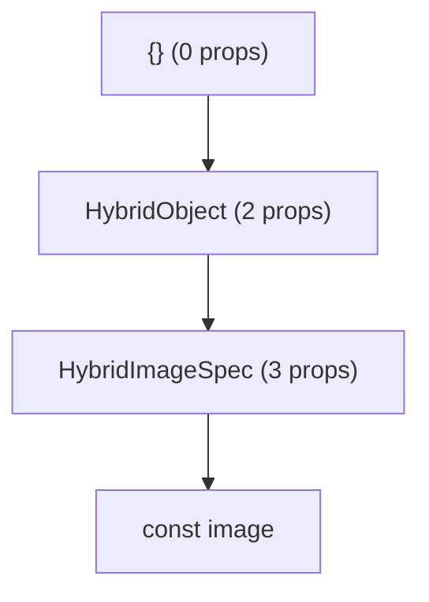

---
---

import Tabs from '@theme/Tabs';
import TabItem from '@theme/TabItem';

# Hybrid Objects

A **Hybrid Object** is a native object that can be used from JS like any other object.
They can have natively implemented methods, as well as properties (get + set).

<div className="side-by-side-container">
<div className="side-by-side-block">

```ts title="Math.nitro.ts"
interface Math extends HybridObject {
  readonly pi: number
  add(a: number, b: number): number
}
```

</div>
<div className="side-by-side-block">

```swift title="HybridMath.swift"
class HybridMath : HybridMathSpec {
  var pi: Double {
    return Double.pi
  }
  func add(a: Double, b: Double) -> Double {
    return a + b
  }
}
```

</div>
</div>

Hybrid Objects can be created using `createHybridObject(...)` if they have been registered on the native side:

```ts
const math = NitroModules.createHybridObject<Math>("Math")
const result = math.add(5, 7)
```

A Hybrid Object can also create other Hybrid Objects:

```ts title="Image.nitro.ts"
interface Image extends HybridObject {
  readonly width: number
  readonly height: number
  saveToFile(path: string): Promise<void>
}

interface ImageFactory extends HybridObject {
  loadImageFromWeb(path: string): Promise<Image>
  loadImageFromFile(path: string): Image
  loadImageFromResources(name: string): Image
}
```

Each instance of a Hybrid Object reflects it's actual native memory size, so the JavaScript runtime can garbage-collect unused objects more efficiently.
Additionally, Hybrid Objects have proper JavaScript prototypes, which are shared between all instances of the same type:

<div align="center">

</div>

## Implementation

Hybrid Objects can be implemented in C++, Swift or Kotlin:

<Tabs groupId="nitrogen-or-not">
  <TabItem value="nitrogen" label="With Nitrogen ✨" default>

  Nitrogen will ✨ automagically ✨ generate native specifications for each Hybrid Object based on a given TypeScript definition:

  ```ts title="Math.nitro.ts"
  interface Math extends HybridObject<{ ios: 'swift', android: 'kotlin' }> {
    readonly pi: number
    add(a: number, b: number): number
  }
  ```

  Running [nitrogen](nitrogen) will generate the native Swift and Kotlin protocol "`HybridMathSpec`", that now just needs to be implemented in a class:

  <Tabs groupId="native-language">
    <TabItem value="swift" label="Swift" default>
      ```swift title="HybridMath.swift"
      class HybridMath : HybridMathSpec {
        public var pi: Double {
          return Double.pi
        }
        public func add(a: Double, b: Double) throws -> Double {
          return a + b
        }
      }
      ```
    </TabItem>
    <TabItem value="kotlin" label="Kotlin">
      ```kotlin title="HybridMath.kt"
      class HybridMath : HybridMathSpec() {
        override var pi: Double
          get() = Double.PI

        override fun add(a: Double, b: Double): Double {
          return a + b
        }
      }
      ```
    </TabItem>
  </Tabs>

  For more information, see the [Nitrogen documentation](nitrogen).

  </TabItem>
  <TabItem value="manually" label="Manually">


  </TabItem>
</Tabs>
