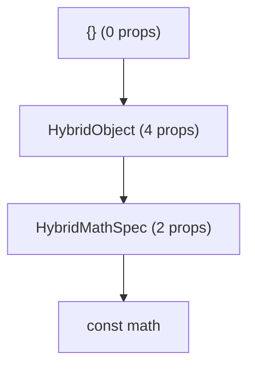

---
---

import Tabs from '@theme/Tabs';
import TabItem from '@theme/TabItem';

# Hybrid Objects

A **Hybrid Object** is a native object that can be used from JS like any other object.
They can have natively implemented methods, as well as properties (get + set).

<div className="side-by-side-container">
<div className="side-by-side-block">

```ts title="Math.nitro.ts"
interface Math extends HybridObject {
  readonly pi: number
  add(a: number, b: number): number
}
```

</div>
<div className="side-by-side-block">

```swift title="HybridMath.swift"
class HybridMath : HybridMathSpec {
  var pi: Double {
    return Double.pi
  }
  func add(a: Double, b: Double) -> Double {
    return a + b
  }
}
```

</div>
</div>

## Working with Hybrid Objects

Hybrid Objects can be created using `createHybridObject(...)` if they have been registered on the native side:

```ts
const math = NitroModules.createHybridObject<Math>("Math")
const result = math.add(5, 7)
```

A Hybrid Object can also create other Hybrid Objects:

```ts title="Image.nitro.ts"
interface Image extends HybridObject {
  readonly width: number
  readonly height: number
  saveToFile(path: string): Promise<void>
}

interface ImageFactory extends HybridObject {
  loadImageFromWeb(path: string): Promise<Image>
  loadImageFromFile(path: string): Image
  loadImageFromResources(name: string): Image
}
```

Each instance of a Hybrid Object reflects it's actual native memory size, so the JavaScript runtime can garbage-collect unused objects more efficiently.
Additionally, Hybrid Objects have proper JavaScript prototypes, which are shared between all instances of the same type:

<div align="center">

</div>

## Base Methods

Every Hybrid Object has base methods and properties:

```ts
const math = NitroModules.createHybridObject<Math>("Math")
const anotherMath = math

console.log(math.name) // "Math"
console.log(math.toString()) // "[HybridObject Math]"
console.log(math.equals(anotherMath)) // true
```

### `dispose()`

Every Hybrid Object has a `dispose()` method.
Usually, you should not need to manually dispose Hybrid Objects as the JS garbage collector will delete any unused objects anyways.
Also, most Hybrid Objects in Nitro are just statically exported singletons, in which case they should never be deleted throughout the app's lifetime.

In some rare, often performance-critical- cases it is beneficial to eagerly destroy any Hybrid Objects, which is why `dispose()` exists.
For example, [VisionCamera](https://github.com/mrousavy/react-native-vision-camera) uses `dispose()` to clean up already processed Frames to make room for new incoming Frames:

```ts
const onFrameListener = (frame: Frame) => {
  doSomeProcessing(frame)
  frame.dispose()
}
```

## Implementation

Hybrid Objects can be implemented in C++, Swift or Kotlin:

<Tabs groupId="nitrogen-or-not">
  <TabItem value="nitrogen" label="With Nitrogen ✨" default>

  Nitrogen will ✨ automagically ✨ generate native specifications for each Hybrid Object based on a given TypeScript definition:

  ```ts title="Math.nitro.ts"
  interface Math extends HybridObject<{ ios: 'swift', android: 'kotlin' }> {
    readonly pi: number
    add(a: number, b: number): number
  }
  ```

  Running [nitrogen](nitrogen) will generate the native Swift and Kotlin protocol "`HybridMathSpec`", that now just needs to be implemented in a class:

  <Tabs groupId="native-language">
    <TabItem value="swift" label="Swift" default>
      ```swift title="HybridMath.swift"
      class HybridMath : HybridMathSpec {
        public var hybridContext = margelo.nitro.HybridContext()
        public var memorySize: Int {
          return getSizeOf(self)
        }

        public var pi: Double {
          return Double.pi
        }
        public func add(a: Double, b: Double) throws -> Double {
          return a + b
        }
      }
      ```
    </TabItem>
    <TabItem value="kotlin" label="Kotlin">
      ```kotlin title="HybridMath.kt"
      class HybridMath : HybridMathSpec() {
        override val memorySize: Long
            get() = 0L

        override var pi: Double
          get() = Double.PI

        override fun add(a: Double, b: Double): Double {
          return a + b
        }
      }
      ```
    </TabItem>
  </Tabs>

  For more information, see the [Nitrogen documentation](nitrogen).

  </TabItem>
  <TabItem value="manually" label="Manually">

  To implement a Hybrid Object without nitrogen, you just need to create a C++ class that inherits from the [`HybridObject`](https://github.com/mrousavy/nitro/blob/main/packages/react-native-nitro-modules/cpp/core/HybridObject.hpp) base class, and override `loadHybridMethods()`:

  <div className="side-by-side-container">
    <div className="side-by-side-block">
      ```cpp title="HybridMath.hpp"
      class HybridMath: public HybridObject {
      public:
        HybridMath(): HybridObject(NAME) { }

      public:
        double add(double a, double b);

      protected:
        void loadHybridMethods() override;

      private:
        static constexpr auto NAME = "Math";
      };
      ```
    </div>
    <div className="side-by-side-block">
      ```cpp title="HybridMath.cpp"
      double HybridMath::add(double a, double b) {
        return a + b;
      }

      void HybridMath::loadHybridMethods() {
        // register base methods (toString, ...)
        HybridObject::loadHybridMethods();
        // register custom methods (add)
        registerHybrids(this, [](Prototype& proto) {
          proto.registerHybridMethod(
            "add",
            &HybridMath::add
          );
        });
      }
      ```
    </div>
  </div>

  A Hybrid Object should also override `getExternalMemorySize()` to properly reflect native memory size:

  ```cpp
  class HybridMath: public HybridObject {
  public:
    // ...
    size_t getExternalMemorySize() override {
      return sizeOfSomeImageWeAllocated;
    }
  }
  ```

  Optionally, you can also override `toString()` and `dispose()` for custom behaviour.

  </TabItem>
</Tabs>

## Memory Size (`memorySize`)

Since it's implementation is in native code, the JavaScript runtime does not know the actual memory size of a Hybrid Object.
Nitro allows Hybrid Objects to declare their memory size via the `memorySize`/`getExternalMemorySize()` accessors, which can account for any external heap allocations you perform:

```swift
class HybridImage : HybridImageSpec {
  private var cgImage: CGImage
  public var memorySize: Int {
    let imageSize = cgImage.width * cgImage.height * cgImage.bytesPerPixel
    return getSizeOf(self) + imageSize
  }
}
```

Any unused `Image` objects can now be deleted sooner by the JS garbage collector, preventing memory pressures or frequent garbage collector calls.

:::tip
It is safe to return `0` here, but recommended to somewhat closely estimate the actual size of native object if possible.
:::
